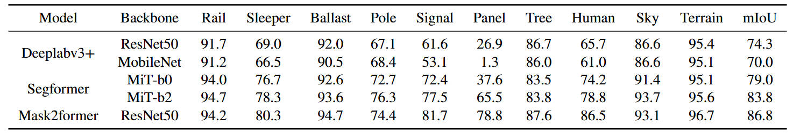

# 🚄 SRID-BJRU: A Simulation Framework and Dataset for Railway Intrusion Detection

## Download
[Google Drive](https://drive.google.com/drive/folders/1HyAO2aniWTGOlI99I55eidfwwHQhABTD?usp=sharing)  
[Baidu Drive](https://pan.baidu.com/s/16I0QVheeJeZLkoA2t8RRHw) Password: 7ua3

## Dataset Description

### Overview

**SRID-BJTU** is a synthetic railway intrusion detection dataset designed for safety monitoring, featuring diverse railway scenes such as tunnels, bridges, and intersections under various environmental conditions.

    

We simulated various illumination settings, including daytime, dawn/dusk, and nighttime, to evaluate the performance of detection algorithms under different lighting conditions.

    

### Data Collection and Annotation

We collected **7,142** annotated images. The table below provides detailed information regarding the number of images and object bounding boxes across different scenarios.

    

A total of **11,898 bounding boxes** were automatically generated, following the MS COCO metrics.

    

The following figure shows the distribution of all annotation boxes in the dataset:

    

## Experiment Result

### Object detection experimental results of training and validation on simulated dataset.

    

    

### Object detection experimental results of training on only real dataset and using simulated data as data augmentation, validation on real dataset.

    

    

### Semantic segmentation experimental results of training and validation on simulated dataset.

    

    

### Semantic segmentation experimental results of training on only real dataset and using simulated data as data augmentation, validation on real dataset.

    

    

## 📚 References

- [YOLOv5](https://github.com/ultralytics/yolov5) – Ultralytics
- [YOLOv8](https://github.com/ultralytics/ultralytics) – Ultralytics
- [Faster R-CNN](https://arxiv.org/abs/1506.01497) – Girshick et al.
- [RT-DETR](https://arxiv.org/abs/2304.080692) – Carion et al.
- [DeepLabV3+](https://arxiv.org/abs/1802.02611) – Chen et al.
- [SegFormer](https://arxiv.org/abs/2105.15203) – Xie et al.
- [Mask2Former](https://arxiv.org/abs/2112.01527) – Cheng et al.
- [RailSem19 Dataset](https://ieeexplore.ieee.org/document/90256469) – Zendel et al.
